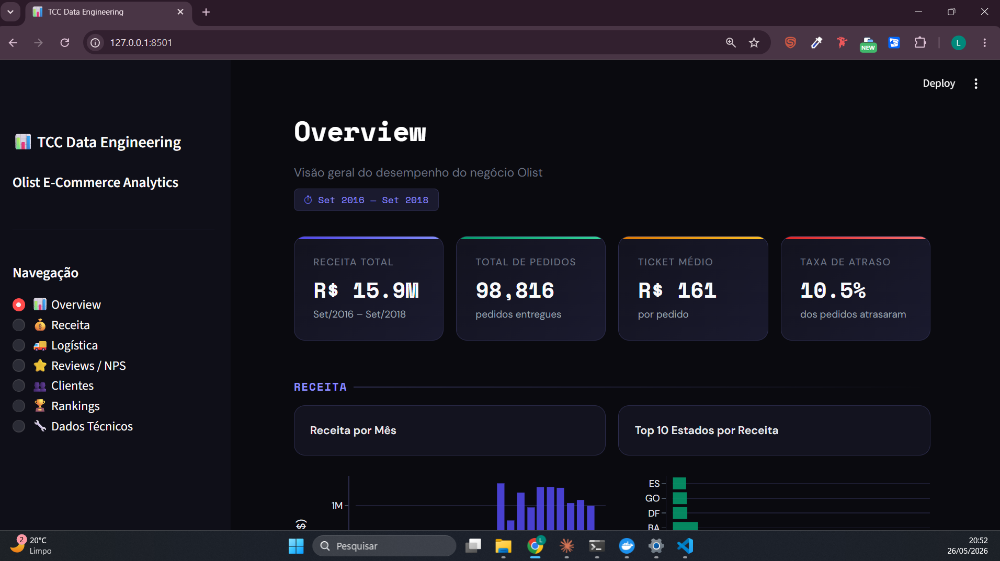

# TCC Data Engineering — Olist E-Commerce Analytics

> Pipeline de dados end-to-end com ingestão, transformação em camadas e dashboard analítico, construído sobre uma stack de engenharia de dados moderna e totalmente containerizada.

[](https://python.org)
[](https://spark.apache.org)
[](https://airflow.apache.org)
[](https://postgresql.org)
[](https://streamlit.io)
[](https://docker.com)

---

##  Sobre o Projeto

Este projeto implementa um pipeline de dados completo para análise do dataset público da **Olist** (e-commerce brasileiro), disponível no Kaggle. O objetivo é demonstrar na prática os conceitos de Engenharia de Dados, desde a ingestão bruta até a visualização em um dashboard analítico interativo.

**Dataset:** [Brazilian E-Commerce Public Dataset by Olist](https://www.kaggle.com/datasets/olistbr/brazilian-ecommerce) — ~100k pedidos entre 2016 e 2018.

---

## Demo

> 📹 [Assista ao vídeo de demonstração](https://www.youtube.com/watch?v=8x7fRGnNbV4)

<!-- adicione um print do dashboard -->

---

## Arquitetura

```
┌─────────────────────────────────────────────────────────────────────┐
│                          PIPELINE DE DADOS                          │
└─────────────────────────────────────────────────────────────────────┘

  ┌──────────┐     ┌─────────────────────────────────────────────┐
  │  Kaggle  │────▶│              Apache Airflow                 │
  │  Olist   │     │         (Orquestração dos DAGs)             │
  └──────────┘     └──────────────────┬──────────────────────────┘
                                      │
                          ┌───────────▼───────────┐
                          │      Apache Spark      │
                          │   (Processamento)      │
                          └───────────────────────┘
                                      │
              ┌───────────────────────┼───────────────────────┐
              │                       │                       │
    ┌─────────▼──────┐    ┌──────────▼──────┐    ┌──────────▼──────┐
    │   RAW Layer    │───▶│  Bronze Layer   │───▶│  Silver Layer   │
    │  (dados brutos │    │ (padronização,  │    │  (limpeza,      │
    │   do Kaggle)   │    │  tipos, schema) │    │   validação,    │
    └────────────────┘    └─────────────────┘    │   flags)        │
                                                 └────────┬────────┘
                                                          │
                                               ┌──────────▼──────────┐
                                               │    Gold Layer        │
                                               │  (dimensões, fatos   │
                                               │   e métricas)        │
                                               └──────────┬──────────┘
                                                          │
                                               ┌──────────▼──────────┐
                                               │  PostgreSQL (DW)     │
                                               │  dim_customers       │
                                               │  dim_products        │
                                               │  dim_sellers         │
                                               │  fact_orders         │
                                               │  fact_order_items    │
                                               │  metrics_revenue     │
                                               │  metrics_delivery    │
                                               │  metrics_reviews     │
                                               │  metrics_cohort      │
                                               │  metrics_abc         │
                                               └──────────┬──────────┘
                                                          │
                                               ┌──────────▼──────────┐
                                               │  Streamlit + Plotly  │
                                               │  Dashboard Analítico │
                                               └─────────────────────┘
```

---

##  Estrutura do Projeto

```
TCC-DATA-ENGINEERING/
├── airflow/
│   └── dags/                        # DAGs de orquestração
├── app/
│   ├── app.py                       # Entrypoint Streamlit
│   ├── components/
│   │   ├── database.py              # Conexão PostgreSQL
│   │   └── theme.py                 # CSS e tema do dashboard
│   └── views/
│       ├── overview.py              # Visão geral
│       ├── revenue.py               # Análise de receita
│       ├── logistics.py             # Logística e entregas
│       ├── reviews.py               # NPS e avaliações
│       ├── customers.py             # Clientes e cohort
│       ├── ranking.py               # Rankings e curva ABC
│       └── technical.py            # Dados técnicos
├── docker/
│   ├── airflow/Dockerfile
│   ├── spark/Dockerfile
│   └── streamlit/Dockerfile
├── src/
│   └── spark/
│       ├── spark_session.py
│       └── jobs/
│           ├── ingestion/
│           │   └── spark_job_ingest_raw_olist.py
│           └── transform/
│               ├── spark_job_transform_bronze_layer.py
│               ├── spark_job_transform_silver_layer.py
│               ├── spark_job_transform_gold_dimensions.py
│               └── spark_job_transform_gold_metrics.py
├── docker-compose.yml
├── requirements-spark.txt
├── requirements-streamlit.txt
└── README.md
```

---

##  Pipeline — DAGs do Airflow

| DAG | Descrição |
|-----|-----------|
| `download_olist_dataset` | Baixa o dataset do Kaggle via API |
| `ingest_raw_olist` | Ingere os CSVs brutos para o MinIO (Raw Layer) |
| `transform_bronze_layer` | Padroniza schemas e tipos de dados |
| `transform_silver_layer` | Limpeza, validações e flags de qualidade |
| `transform_gold_dimensions` | Cria as tabelas dimensão (dim_*) |
| `transform_gold_metrics` | Calcula métricas e fatos (fact_*, metrics_*) |

---

##  Dashboard Analítico

O dashboard possui 7 seções:

| Página | Conteúdo |
|--------|----------|
| **Overview** | KPIs gerais, receita mensal, status dos pedidos, NPS |
| **Receita** | Filtro por período, ticket médio, mapa por estado, categorias, cancelamentos |
| **Logística** | Tempo de entrega, SLA, taxa de atraso por estado |
| **Reviews / NPS** | NPS mensal, distribuição promotores/detratores, score por categoria |
| **Clientes** | Aquisição, LTV, análise de cohort e retenção |
| **Rankings** | Top sellers, top categorias, curva ABC |
| **Dados Técnicos** | Qualidade dos dados, flags de inconsistência, query livre |

---

## Stack Tecnológica

| Camada | Tecnologia |
|--------|-----------|
| Orquestração | Apache Airflow 2.8.1 |
| Processamento | Apache Spark 3.5.1 + PySpark |
| Data Lake | MinIO (S3-compatible) |
| Data Warehouse | PostgreSQL 15 |
| Visualização | Streamlit + Plotly |
| Containerização | Docker + Docker Compose |
| Linguagem | Python 3.10 |

---

##  Como Executar

### Pré-requisitos
- Docker e Docker Compose instalados
- Conta no Kaggle com API key configurada

### 1. Clone o repositório
```bash
git clone https://github.com/llucashenrique/TCC-DATA-ENGINEERING.git
cd TCC-DATA-ENGINEERING
```

### 2. Configure as variáveis de ambiente
```bash
cp docker/.env.example docker/.env
# Edite o .env com suas credenciais
```

### 3. Suba os containers
```bash
cd docker
docker compose up --build -d
```

### 4. Acesse os serviços

| Serviço | URL | Credenciais |
|---------|-----|-------------|
| Streamlit Dashboard | http://localhost:8501 | — |
| Apache Airflow | http://localhost:8081 | admin / admin |
| MinIO Console | http://localhost:9001 | ver .env |
| pgAdmin | http://localhost:5050 | ver .env |
| Spark Master UI | http://localhost:8080 | — |

### 5. Execute o pipeline
No Airflow (`http://localhost:8081`), ative e execute os DAGs na ordem:
1. `download_olist_dataset`
2. `ingest_raw_olist`
3. `transform_bronze_layer`
4. `transform_silver_layer`
5. `transform_gold_dimensions`
6. `transform_gold_metrics`

---

## Principais Métricas do Dataset

| Métrica | Valor |
|---------|-------|
| Período | Set/2016 — Set/2018 |
| Total de Pedidos | ~98.800 |
| Receita Total | R$ 15,9M |
| Ticket Médio | R$ 160 |
| NPS Médio | 43,9 |
| Score Médio | 4,09 / 5 |
| Taxa de Atraso | 10,5% |
| Tempo Médio de Entrega | 14,3 dias |

---

##  Autor

**Lucas Henrique**

[](https://github.com/llucashenrique)
[](https://www.linkedin.com/in/llucashenrique)

---

## 📄 Licença

Este projeto foi desenvolvido como Trabalho de Conclusão de Curso (TCC). Sinta-se livre para usar como referência.
